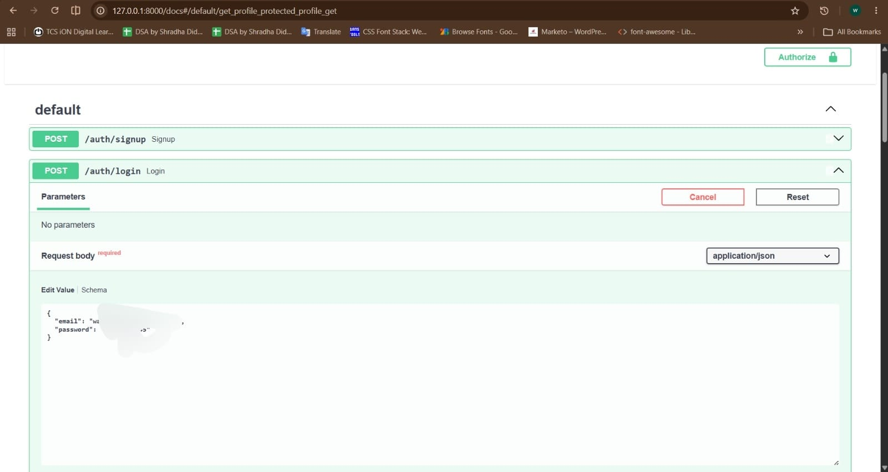
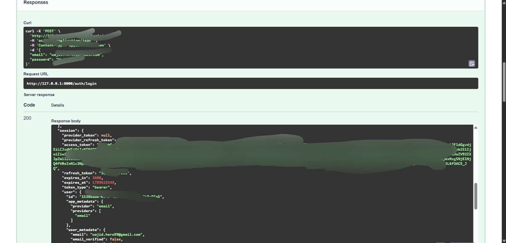
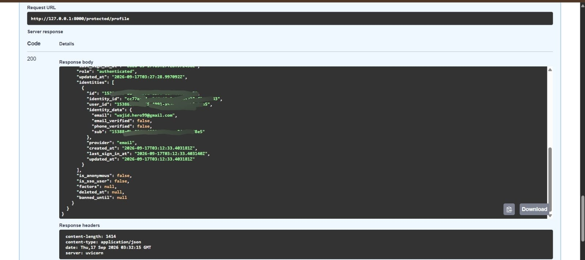
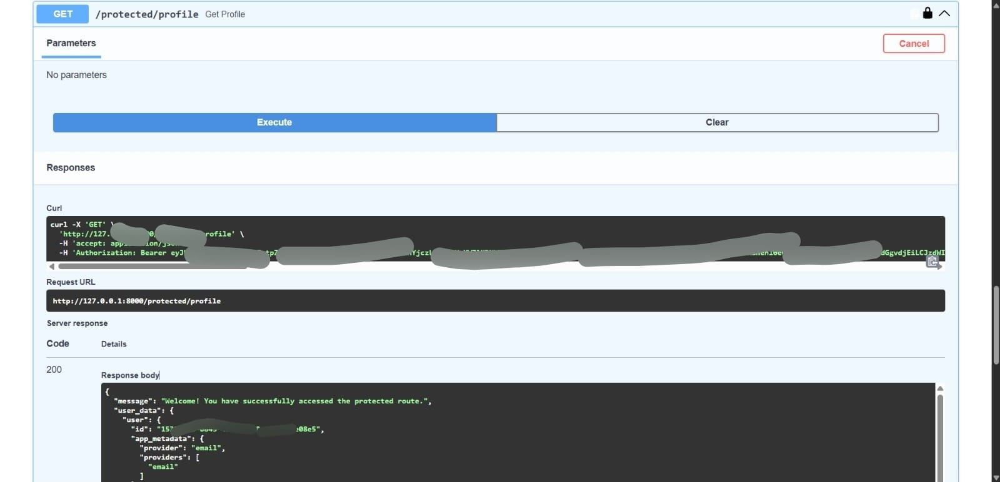

# Secure Auth API with FastAPI & Supabase
**Author:** Wajid Ali Ansari  
**Track:** FlyRank Backend Internship - Week 2 (Auth: Login & Protect)

##  Project Overview
This project is a secure backend REST API built with **FastAPI** and **Supabase Authentication**. It demonstrates modern web security principles by handling user registration, login, and secure sessions without manually storing or hashing passwords. It utilizes Supabase as the Identity Provider (IdP) to issue **JSON Web Tokens (JWTs)** and implements custom middleware (dependencies) to guard protected routes against unauthorized access.

##  Tech Stack
* **Framework:** Python, FastAPI
* **Authentication / Database:** Supabase Auth SDK (`supabase-py`)
* **Server:** Uvicorn
* **Environment Management:** `python-dotenv`
* **Documentation:** Built-in Swagger UI

##  Setup & Installation

**1. Clone the repository**
```bash
git clone https://github.com/wajidaliansari/WEEK4_Capsone_Auth---Login-protect.git
cd "WEEK4_Capsone_Auth - Login & protect"
```

**2. Install dependencies**
```bash
pip install fastapi uvicorn supabase python-dotenv pydantic
```

**3. Configure Environment Variables**
Create a `.env` file in the root directory and add:
```env
SUPABASE_URL="your_supabase_project_url"
SUPABASE_KEY="your_supabase_anon_key"
```
**4. Run the Server**
```bash
uvicorn main:app --reload
```
##  API Reference

| HTTP Method | Endpoint | Purpose | Auth Required? |
| :--- | :--- | :--- | :--- |
| **POST** | `/auth/signup` | Create a new user account | No |
| **POST** | `/auth/login` | Authenticate user & return JWT | No |
| **POST** | `/auth/logout` | Terminate the user session | Yes (Bearer Token) |
| **GET** | `/public/info` | Read public, unprotected data | No |
| **GET** | `/protected/profile` | Read private user profile data | Yes (Bearer Token) |

##  Swagger UI & Bearer Token Authentication

The API documentation is automatically generated and available at `http://127.0.0.1:8000/docs`. 

FastAPI's `HTTPBearer` security scheme has been configured. To access protected routes:

1. Generate an `access_token` via the `/auth/login` endpoint.
2. Click the green **Authorize** padlock icon at the top of the Swagger UI.
3. Paste the token (without quotes or the "Bearer " prefix) and click **Authorize**.

##  AI vs Me (Optional Stage 7)

*I prompted an AI assistant to build the exact same setup to compare approaches.*

* **Token Extraction:** The AI successfully handled the `"Bearer "` prefix parsing by relying on FastAPI's native `HTTPBearer` dependency, avoiding manual string splitting errors.
* **Security Flaws:** While the AI generated standard boilerplate, I had to manually configure Supabase dashboard rules (disabling email confirmation) to ensure smooth local testing without SMTP setups.
* **Prompting Lessons:** I learned that unless explicitly told, AI might assume default token expiration times or forget to map specific error codes like `401 Unauthorized` for tampered tokens over generic `500 Server Errors`.

### 📸 Proof of Execution (Screenshots)
### 📸 Proof of Execution (Screenshots)

**1. Swagger UI Auth Setup & Successful Login**



**2. Accessing Protected Route (200 OK)**

